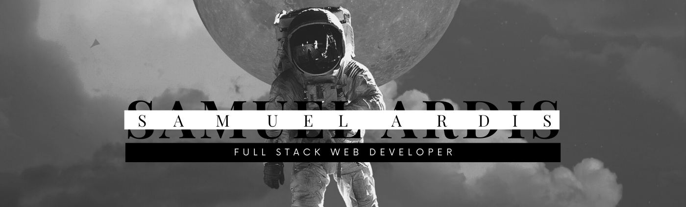

## Hi, I'm Sam 👋:computer:

##### I am a Full Stack Web Developer that is passionate about creating applications and websites that are accessible, efficient, and user-friendly.

##### My stack is...
###### Frontend: HTML, CSS, Sass, JavaScript, and React

###### Backend: Node.js, Express, SQL, RESTful API's, and Python.

###### However, I am always learning new languages and tools to further my expertise.

**Check out my portfolio in the featured section and some project in my accomplishments section below**

###### I would love to connect and work on projects with anyone, so feel free to get in touch!

###### Contact me through LinkedIn if you have any questions or just want to say hi.

###### I am open to internships and work opportunities.

###### Best,

###### Sam A :rocket:

- 🔭 I’m currently working on ...
- 🌱 I’m currently learning ...
- 👯 I’m looking to collaborate on ...
- 🤔 I’m looking for help with ...
- 💬 Ask me about ...
- 📫 How to reach me: ...
- 😄 Pronouns: He/Him...
- ⚡ Fun fact: ...
